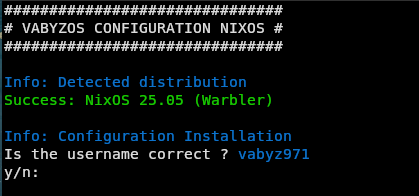
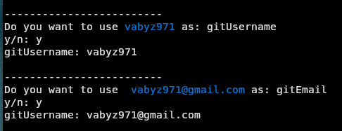
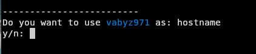
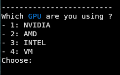
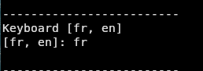
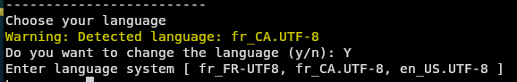
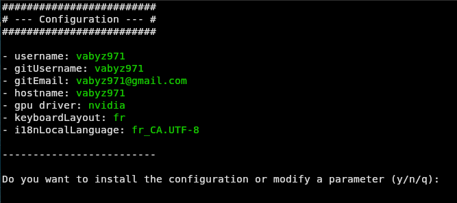

<div align="center"> 

<h1>VABYZ OS  Nixos Configs</h1>

 
 
 
<h3>Welcome to my nixos setup.</h3>

</div>

## DE (Desktop Environnement)

### Gnome


#### - the gnome installation with software is more than 10gb+

## Requirements
 - Version nixos : 25.05
 - Version packages : unstable
 - Boot partition required


## Logiciel

<details>
<summary><strong> 📕 List of software </strong></summary>


| Software      ||
|---------------|---|
|vivaldi        | |
|firefox        | |
|zen-browser    | |
|git            | |
|vscodium       | |
|discord        | |
|htop           | |
|mission-center | |
|fastfetch      | |
|python 3.15    | |
|nodejs 24      | |
|steam          | |
|FlatHub        | |
|zsh            | |
|kitty          | |

### If you install the gnome DE

| Theme      |Type|
|---------------|---|
|Orchis-Dark|theme|
|Papirus-Dark|iconTheme|
|Bibata-Modern-Ice|cursorTheme|

| Software      ||
|---------------|---|
|gnome-tweaks           | |
|gnome-decoder          | |
|fragments              | |
|warp                   | |
|gnome-secrets          | |
|gjs                    | |
|poppler                | |
|dconf-editor           | |

| Extension GNOME| |
|----------------|-------|
|user-theme                 | |
|Bluetooth-Battery-Meter    | |
|trayIconsReloaded          | |
|add-to-desktop             | |
|gtk4-ding                  | |
|blur-my-shell              | |
|dash-to-dock               | |
|Vitals                     | |
|tilingshell                | |
|logomenu                   | |
|lockkeys                   | |
|mediacontrols              | |
</details>


## Installation:

<details>
<summary><strong> ⬇️ Install with script </strong></summary>

### 1. Install dependencies
```bash
nix-shell -p git
```

### 2. Clone the project
```bash
git clone https://github.com/vabyz971/vabyzOS
```

### 3. Run the installation script
```bash
./install.sh
```

### 4. Enter username or default


### 5. Enter your github username and email if you have one


### 6. Enter a hostname or leave as default 


### 7. What GPU are you using (Currently I only have NVIDIA GPUs)


### 8. Enter your keyboard layout


### 9. Enter yes or no to change language


### 10. You will have a view of the configuration before validating
#### y : install
#### n : reconfigure
#### q : exit the installation


### 11. After installation restart your machine 

</details>

## Crédit:
Inspire projects: 
- [ZaneyOS alias Zaney](https://gitlab.com/Zaney/zaneyos/)
- [JaKooLit](https://github.com/JaKooLit/NixOS-Hyprland)
